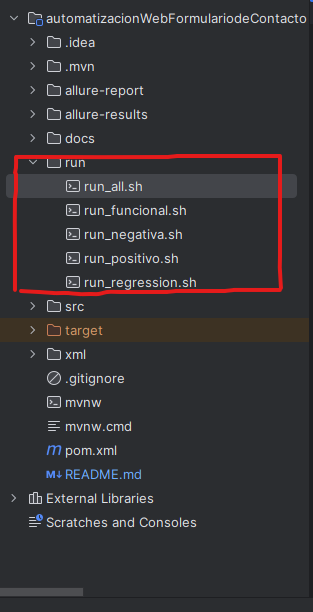
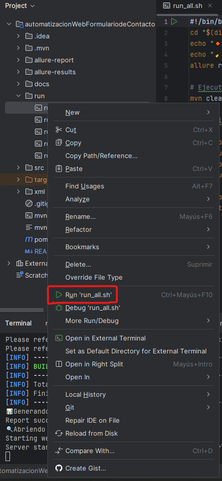
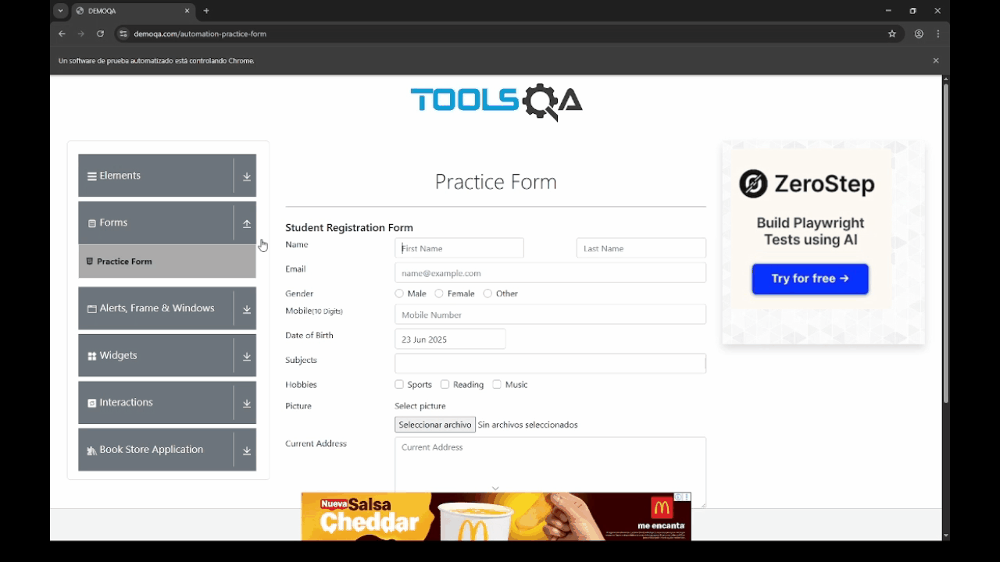
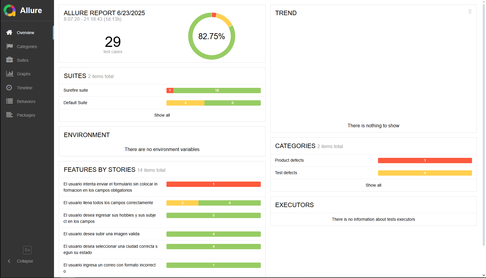

# Formulario de Contacto Automatizado

## Objetivo

Automatizar la validación de un formulario web usando Selenium, con un enfoque profesional: estructura limpia, buenas prácticas, reportes y uso de herramientas de automatización modernas.

##  1. Definición del Proyecto

| Elemento | Detalle |
| --- | --- |
| **Nombre del proyecto** | Automatización Web – Formulario de Contacto |
| **Stack** | Java + Selenium + TestNG + Allure + Maven |
| **Objetivo** | Validar que los campos del formulario funcionan correctamente |
| **Tipo de pruebas** | Funcionales, E2E, validaciones negativas y positivas |
| **Extras** | Screenshots, estructura con Page Object Model. |

##  2. Estructura del Proyecto

```
bash
CopiarEditar
AutomationContactForm/
├── pom.xml
├── testng.xml
├── /src
│   ├── /main
│   │   └── /java
│   │       └── pages/
│   │           └── ContactFormPage.java
│   ├── /test
│       └── /java
│           ├── tests/
│           │   └── ContactFormTest.java
│           └── utils/
│               ├── DriverFactory.java
│               └── ScreenshotUtil.java
```

###  3. Casos de Prueba

| ID | Descripción | Tipo |
| --- | --- | --- |
| TC01 | Envío exitoso del formulario con todos los campos completos | Positiva |
| TC02 | Validación de campos obligatorios vacíos | Negativa |
| TC03 | Validación de formato incorrecto de email | Negativa |
| TC04 | Ingreso de número telefónico con menos de 10 dígitos | Negativa |
| TC05 | Selección de múltiples hobbies y subjects | Funcional |
| TC06 | Carga de imagen válida | Funcional |
| TC07 | Validación dinámica de Cities según State | Funcional |

###  4. Estrategia de Automatización

**Diseño del Test:**

- Aplicación del patrón Page Object Model para separar lógica de interfaz y lógica de pruebas.
- Uso de `@BeforeMethod` y `@AfterMethod` para iniciar/cerrar el navegador.
- Implementación de `DataProvider` para combinaciones de datos.

**Manejo de errores:**

- Captura automática de pantalla en caso de fallo.
- Validación de alertas y mensajes en pantalla.

**Interacciones complejas:**

- Uso de `Actions` y `JavaScriptExecutor` para manejar calendario y dropdowns.
- Uso de `WebDriverWait` para garantizar sincronización.

---
## 5. ¿Como Usar?
En la raiz del proyecto se encuentra una carpeta denominada "run", la cual contiene diferentes archivos .sh, en su nombre tiene el distintivo del grupo de test que ejecutan, para esto es necesario usar GitBash y Allure instalados para poder ejecutarlos 
  


Unicamente basta con dar click derecho y darle en la opcion de "run" para ejecutar los test 
  


###  6. Reportes y Evidencias

- Reportes generados con **Allure** para visualizar pasos y resultados.
- Capturas automáticas de errores integradas al reporte.
  

---

###  7. Buenas Prácticas Aplicadas

- Separación clara entre lógica de prueba y lógica de UI.
- Código limpio, modular y comentado.
- Manejo robusto de sincronización y validaciones.
- Reutilización de métodos y mantenibilidad.

---
### 8. Desafíos y Retos del Proyecto

Durante el desarrollo del proyecto, los mayores retos que enfrentamos fueron:

- **Manejo de menús desplegables (dropdown):** Al mover el cursor del mouse, los menús se ocultaban automáticamente, lo que dificultaba la interacción y la automatización de la selección de opciones.
- **Validación de selección de fechas:** Trabajar con un menú personalizado para seleccionar fechas requirió implementar lógica especial para validar correctamente las entradas, ya que no era un control estándar.

Estos desafíos nos obligaron a buscar soluciones creativas y ajustar nuestras estrategias de automatización para garantizar la estabilidad y precisión de las pruebas.

---

###  9. Futuras Mejoras

- Integración con Jenkins o GitHub Actions para CI/CD.
- Soporte para ejecución paralela.
- Mejora de cobertura con pruebas de regresión.
- Integración con métricas automatizadas de cobertura.

---

### 10. Reportes
Se genera automaticamente un reporte con el framework de allurereports, guarda datos sobre la ejecución de la prueba y toma capturas de pantalla a modo de evidencia de la ejecución. Para poder visualizar dicho informe es necesario abrir el servidor de allurserver(Es necesario tener instalado allurereports).
Los informes que presenta se ven asi:

